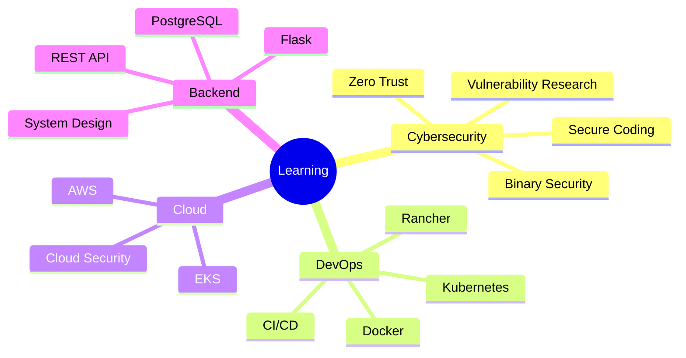

<div align="center">


<a href="https://git.io/typing-svg">
  
</a>

<br/>


</div>

---

## 👨‍💻 About Me

```yaml
name: Thanh Thu
username: ThanhThuw5206
location: Vietnam

focus:
  - Cybersecurity
  - DevOps
  - Backend Development
  - Cloud & Infrastructure
  - Networking

currently_learning:
  - Secure Coding
  - Vulnerability Research
  - Docker & Kubernetes
  - AWS Cloud
  - Linux Administration
  - CI/CD

interests:
  - Application Security
  - DevSecOps
  - Cloud Security
  - Network Security
  - Backend Systems
  - Automation

philosophy: "Learn. Build. Break. Secure. Repeat."
```

I enjoy exploring how systems work, how they fail, and how to build them better.

My main interests are **Cybersecurity, DevOps, Backend Development, Cloud Infrastructure and Networking**. I use GitHub to document my learning journey, labs, university projects, security research and infrastructure experiments.

---

## 🛡️ Cybersecurity & DevOps

<div align="center">

### Security


### DevOps & Cloud


</div>

---

## ⚡ Tech Stack

<div align="center">

### Languages


### Backend & Database


### DevOps & Infrastructure


### Tools & Environment


</div>

---

## 🔐 Areas I'm Exploring

```text
┌─────────────────────────────────────────────────────────────┐
│                        SECURITY                             │
├─────────────────────────────────────────────────────────────┤
│  ▸ Secure Coding            ▸ Vulnerability Management     │
│  ▸ Binary Exploitation      ▸ Application Security         │
│  ▸ Network Security         ▸ DevSecOps                    │
│  ▸ Zero Trust Architecture  ▸ Cloud Security               │
└─────────────────────────────────────────────────────────────┘

┌─────────────────────────────────────────────────────────────┐
│                     DEVOPS / CLOUD                          │
├─────────────────────────────────────────────────────────────┤
│  ▸ Docker                  ▸ Kubernetes                    │
│  ▸ Amazon AWS              ▸ CI/CD                         │
│  ▸ Linux Administration    ▸ Infrastructure Automation     │
│  ▸ Monitoring              ▸ Cloud-native Architecture     │
└─────────────────────────────────────────────────────────────┘
```

---

## 🚀 Featured Work

<table>
<tr>
<td width="50%" valign="top">

### 🛡️ Security Research

Research and experiments related to:

- Vulnerability management
- Secure programming
- Integer overflow
- Software vulnerabilities
- Code review
- Vulnerability detection
- Security automation

</td>

<td width="50%" valign="top">

### ☁️ DevOps & Cloud

Hands-on projects involving:

- Docker containers
- Kubernetes
- Rancher
- Amazon EKS
- CI/CD workflows
- Linux servers
- Cloud infrastructure

</td>
</tr>

<tr>
<td width="50%" valign="top">

### 🌐 Networking

Projects and labs covering:

- Network administration
- Routing & switching
- TCP/IP
- Network security
- Zero Trust
- Service Mesh
- Network policies

</td>

<td width="50%" valign="top">

### ⚙️ Backend Development

Building backend systems with focus on:

- REST APIs
- Flask
- Database design
- Authentication
- Administration systems
- Secure backend architecture

</td>
</tr>
</table>

---

## 📌 Featured Projects

<div align="center">

<a href="https://github.com/ThanhThuw5206/Nhom12">
  
</a>

</div>

> More projects are being built and documented.  
> Check my repositories to follow my learning journey.

---

## 📊 GitHub Analytics

<div align="center">


</div>

---

## 🔥 Contribution Streak

<div align="center">


</div>

---

## 📈 Contribution Activity

<div align="center">


</div>

---

## 🏆 GitHub Achievements

<div align="center">


</div>

---

## 🧠 Currently Learning



---

## 🎯 Goals

- 🛡️ Improve my knowledge of **Application Security & Vulnerability Research**
- ☁️ Build production-style systems using **Docker, Kubernetes and AWS**
- 🔐 Apply **Security by Design** into software development
- ⚙️ Improve **Backend Architecture & System Design**
- 🐧 Become more proficient with **Linux & Infrastructure**
- 🚀 Build projects that combine **Security + DevOps + Cloud**

---

## 💡 Development Philosophy

<div align="center">

> **"The best way to understand a system is to build it, break it, and secure it."**

<br/>

`Learn` → `Build` → `Break` → `Analyze` → `Secure` → `Automate`

</div>

---

## 🤝 Connect With Me

<div align="center">

<a href="https://github.com/ThanhThuw5206">
  
</a>

<a href="YOUR_LINKEDIN_URL">
  
</a>

<a href="YOUR_FACEBOOK_URL">
  
</a>

<a href="mailto:YOUR_EMAIL">
  
</a>

</div>

---

<div align="center">

### 💻 Thanks for visiting my profile!


</div>
